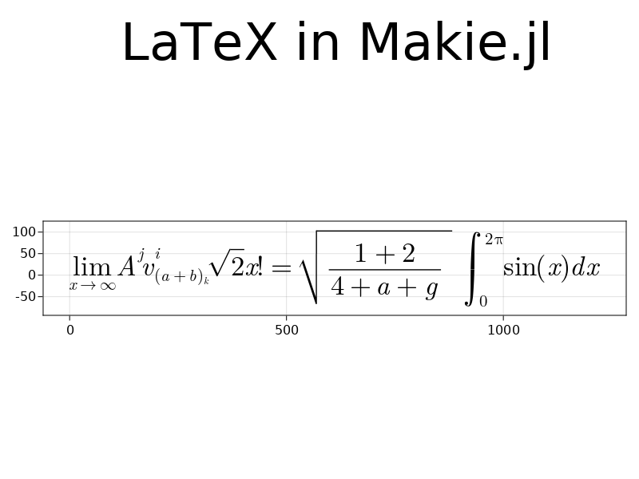

# MathTeXEngine

This is a work in progress package aimed at providing a pure Julia engine for LaTeX math mode. It is composed of two main parts: a LaTeX parser and a LaTeX engine, both only for LaTeX math mode.

## Main features

- Parsing of (possibly nested) LaTeX expression and creation of a layout for them.
- Equivalence between traditional LaTeX commands and their unicode input equivalent.
- Pure julia.

## Engine

The main use of the package is through `generate_tex_elements` taking a LaTeX string as input and return a list of tuples `(TeXElement, position, scale)` where `TeXElement` is one of the following:

- `TeXChar(char, font)` a unicode character to be displayed in a specific font.
- `VLine(height, thickness)` a vertical line.
- `HLine(width, thickness)` an horizontal line.

This contains enough information to then draw everything with any plotting package that can draw arbitrary glyph in arbitrary font. The position is the origin of the character according to `FreeType`.

The engine should support every construction the parser does (see below).

Currently the only font set supported is New Computer Modern.

### Example



## Parser

Parsing is done through the exported function `texparse` into nested `TeXExpr` objects forming a tree. The parser does not perform any operation to layout the elements, it only transforms them into a syntax tree.

### Supported constructions

The table below contains the list of all supported LaTeX construction and their representation when parsed.

| Description | LaTeX example | Expression head | Fields |
|--|--|--|--|
| Delimiter | `\left( \right)` | `:delimited` | `left_delimiter, content, right_delimiter` |
| Fraction | `\frac{}{}` | `:frac` | `numerator, denumerator` |
| Function | `\sin` | `:function` | `name` |
| Generic symbol | `x` | `:symbol` | `char, command` |
| Group | `{ }` | `:group` | `elements...` |
| Integral | `\int_a^b` | `:integral` | `symbol, low_bound, high_bound` |
| Square root | `\sqrt{2}` | `:sqrt` | `content` |
| Spaced symbol | `+` | `:spaced` | `symbol` |
| Subscript and superscript | `x_0^2` | `:decorated` | `core, subscript, superscript` |
| Symbol with script under and/or over it | `\sum_i^k` | `:underover` | `symbol, under, over` |

### To be implemented

| Description | LaTeX example | Head | Fields | Comment |
|--|--|--|--|--|
| Accent | `\vec{v}` | `:accent` | `symbol, core` | May need a specific type of expression for wide accent |
| Basic font | `\mathrm{d}` | `:font` | `fontstyle, content` |
| Space | `\quad` | `:space` | `width` |

### Example

```julia
julia> texparse(raw"\sum^{a_2}_{b + 2} \left[ x + y \right] \Rightarrow \sin^2 ω_k")
TeXExpr :expr
├─ TeXExpr :underover   
│  ├─ TeXExpr :symbol   
│  │  ├─ '∑'
│  │  └─ "\\sum"        
│  ├─ TeXExpr :group    
│  │  ├─ 'b'
│  │  ├─ TeXExpr :spaced
│  │  │  └─ TeXExpr :symbol
│  │  │     ├─ '+'
│  │  │     └─ "+"
│  │  └─ '2'
│  └─ TeXExpr :decorated   
│     ├─ 'a'
│     ├─ '2'
│     └─ nothing
├─ TeXExpr :delimited      
│  ├─ 'x'
│  ├─ TeXExpr :spaced
│  │  └─ TeXExpr :symbol
│  │     ├─ '+'
│  │     └─ "+"
│  ├─ 'y'
│  └─ TeXExpr :right_delimiter
│     └─ ']'
├─ TeXExpr :spaced
│  └─ TeXExpr :symbol
│     ├─ '⇒'
│     └─ "\\Rightarrow"
├─ TeXExpr :decorated
│  ├─ TeXExpr :function
│  │  └─ "sin"
│  ├─ nothing
│  └─ '2'
└─ TeXExpr :decorated
   ├─ TeXExpr :symbol
   │  ├─ 'ω'
   │  └─ "\\omega"
   ├─ 'k'
   └─ nothing
```